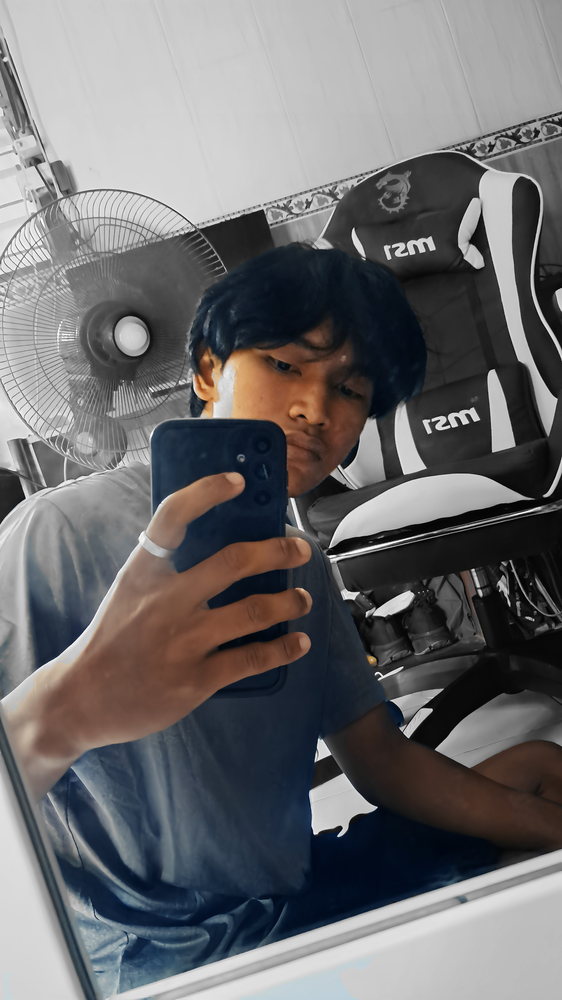

<!DOCTYPE html>
<html lang="en">
<head>
    <meta charset="UTF-8">
    <meta name="viewport" content="width=device-width, initial-scale=1.0">
    <title>Document</title>
</head>
<body>
    
    <h1>Nama Saya Dewa ganteng</h1>   
<h2>Tentang Saya: Sebagai Mahasiswa</h2>

<mark>adalah mahasiswa Rekayasa Sistem Komputer yang tertarik pada web development dan cyber security.</mark>

<!-- Keahlian -->
<h3>Keahlian</h3>
<ul>
    <li>HTML</li>
    <li>CSS</li>
<li>JavaScript</li>
</ul>
<!-- Riwayat Pendidikan -->
 <h3>Riwayat Pendidikan</h3>
 <ol><ol start="1">
    <li>SD Negeri 27 Pemecutan</li>
    <li>SMP Negeri 7 Denpasar</li>
    <li>SMK Negeri 1 Denpasar</li>
 </ol>
 <dl>
    <dt>HTML</dt>
    <dd>Bahasa markup untuk struktur halaman web.</dd>
    <dt>CSS</dt>
    <dd>Bahasa untuk mengatur tampilan halaman web.</dd>
</dl>

<a href="https://facebook.com" target="_blank">pisbuk  </a>
<a href="akamsi.html" target="_blank">akamsi </a>
</body>
</html>
